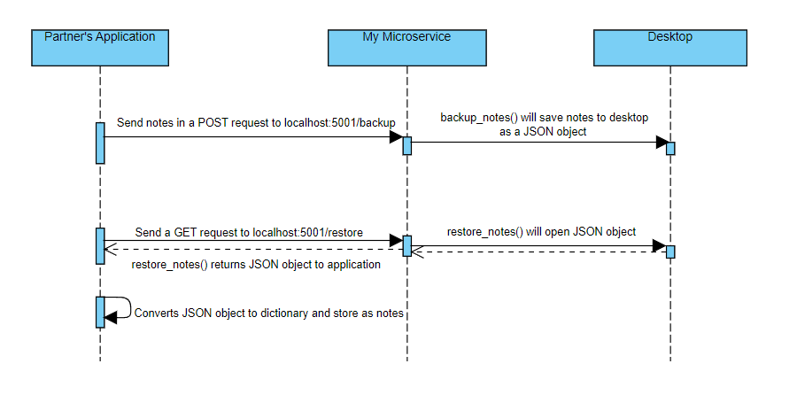

# CS361 
# Communication Contract
# Clear instructions for how to programmatically REQUEST data from the microservice you implemented. Include an example call.

To send a request to the microservice in order to save a back up of the set of notes currently available, my partner's 
application will have to make an HTTP POST request to this address 'http://localhost:5001/backup' using 'requests.post' method
which will have to be imported and send the notes to be saved in dictionary format which the microservice will receive in the
JSON format and then attempt to save the notes to a file on the desktop. 

Example Call: 
Given a sample set of notes that already exist in partner's application as a dictionary (it will get converted to JSON format
in the POST request):
  self.notes = {"Note 1": "This is note 1", "Note 2": "This is note 2"}
Have a button on the application that will trigger this command when pressed/clicked:
  response = requests.post('http://localhost:5001/backup', json=self.notes)

# Clear instructions for how to programmatically RECEIVE data from the microservice you implemented.

To receive the data from the microservice, it first requires the REQUEST to be completed successfully so that there is a file
on the desktop containing a saved set of notes. My partner's application will then have to make an HTTP GET request to the 
address 'http://localhost:5001/restore' using the 'requests.get' imported method which the microservice will listen for. 
Once the GET request is received by the microservice, the backup file will be returned as a JSON object containing the notes
that my partner's application will have to receive using ".json()" to convert the JSON data into a dictionary that can then
be used as the set of notes in the application. 

Example Call:
Have a button on the application that will trigger this command when pressed/clicked:
  response = requests.get('http://localhost:5001/restore')
If the notes in the application are stored as "self.notes" similar to the example above, this command will turn the JSON object into 
a dictionary that will be in the same form as the initial dictionary form when the request was made above:
  self.notes = response.json()
  
# UML sequence diagram showing how requesting and receiving data works. Make it detailed enough that your partner (and your grader) will understand

