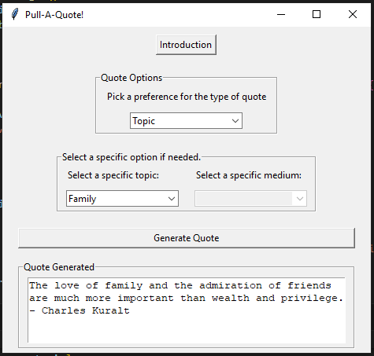
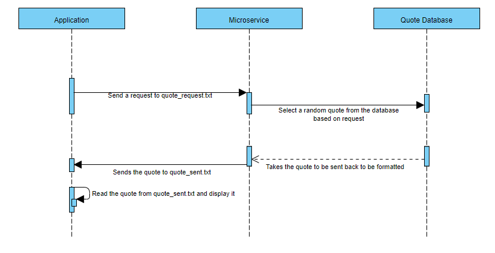

# Pull-A-Quote! - A Random Quote Generator

This project is a tkinter based desktop application that can be run by running both python files concurrently in different instances
to generate a random quote based on the user preferences as long as they are in the same directory with the sample quote collection 
database provided. This project was completed throughout CS361 - Software Engineering I to not only develop and use a microservice but
also to simulate the process for software development in the real-world following the Agile Scrum framework

# Instructions for how to programmatically REQUEST data from the microservice you implemented. 

Create a text file called "quote_request.txt", the microservice reads requests from this file while it is running. 
To request a quote, write a line in this file. The format depends on the type of quote you're requesting: 
For a specific topic: Write "Topic [Your_Topic]" in the quote_request.txt file. Replace [Your_Topic] with one of the topics from the list. 
For a specific medium: Write "Medium [Your_Medium]" in the quote_request.txt file. Replace [Your_Medium] with the desired medium. 
For a random quote: Write "Random" into the text file.
The microservice will validate the request to make sure that it is a valid request. 

Example Call: 
From the shell/terminal in the same directory as the microservice, this is a command you could use to make a request:
echo "Medium Book" > quote_request.txt

In my case, my random quote generator will write to the quote_request.txt file after the user selects their preferences
and clicks the "Generate Quote" button without an error popping up.   

# Clear instructions for how to programmatically RECEIVE data from the microservice you implemented.

After a successful request, a quote will be randomly pulled from the database and written to a text file called "quote_sent.txt"
and the data can then be received by opening the file and reading it.

Example Call:
Command to print contents to the terminal: 
cat quote_sent.txt 

In my case, my random quote generator will only read from the quote_sent.txt file after a valid quote generation request and then
print that to the output area.

## Picture of the Application

# UML sequence diagram showing how requesting and receiving data works. 

# Technologies Used
Python
